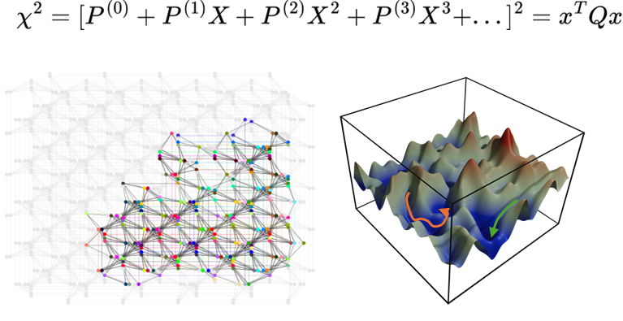

[](https://github.com/QuantumApplicationLab/qubops)
[](https://github.com/QuantumApplicationLab/qubops)
[](https://www.python.org/)
[](https://github.com/psf/black)
[](https://github.com/quantumapplicationlab/qubops/actions/workflows/build.yml)
[](https://coveralls.io/github/QuantumApplicationLab/qubops?branch=master)



## QUBOPS
`qubops` allows solving polynomial system of equations using a QUBO formalism. An example can be found [here](./example/qubops.ipynb)

## Installation

To install qubops from GitHub repository, do:

```console
git clone https://github.com/QuantumApplicationLab/qubops.git
cd qubops
python3 -m pip install .
```
## Example

```python

from qubops.qubops_mixed_vars import QUBOPS_MIXED
from qubops.encodings import PositiveQbitEncoding
from qubops.solution_vector import SolutionVector_V2 as SolutionVector
from qubops.mixed_solution_vector import MixedSolutionVector_V2 as MixedSolutionVector
from dwave.samplers import SteepestDescentSolver

def define_matrices():
    """function that creates the polynom matrices for the system."""
    # see documentation for more information
    return matrices

# define the encoding for the first two varialbes
nqbit = 5
step = 0.05
encoding1 = PositiveQbitEncoding(nqbit = nqbit, step=step, offset=0, var_base_name='x')
sol_vec1 = SolutionVector(2, encoding=encoding1)

# define the encoding for the alst two variables 
nqbit = 4
step = 0.05
encoding2 = PositiveQbitEncoding(nqbit = nqbit, step=step, offset=0, var_base_name='x')
sol_vec2 = SolutionVector(2, encoding=encoding2)

# define the solution vector
sol_vec = MixedSolutionVector([sol_vec1,sol_vec2])

# instantiat the QUBOPS solver
options = {'num_reads':10000, 'sampler':SteepestDescentSolver()}
qubo = QUBOPS_MIXED(sol_vec, options)
sol = qubo.solve(define_matrices(), strength=1E5)

```
## Contributing

If you want to contribute to the development of qubops,
have a look at the [contribution guidelines](CONTRIBUTING.md).

## Credits

This package was created with [Cookiecutter](https://github.com/audreyr/cookiecutter) and the [NLeSC/python-template](https://github.com/NLeSC/python-template).
